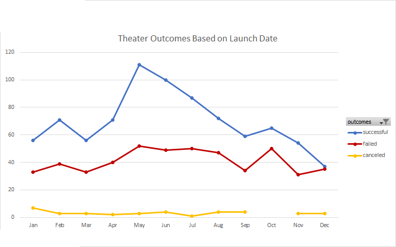
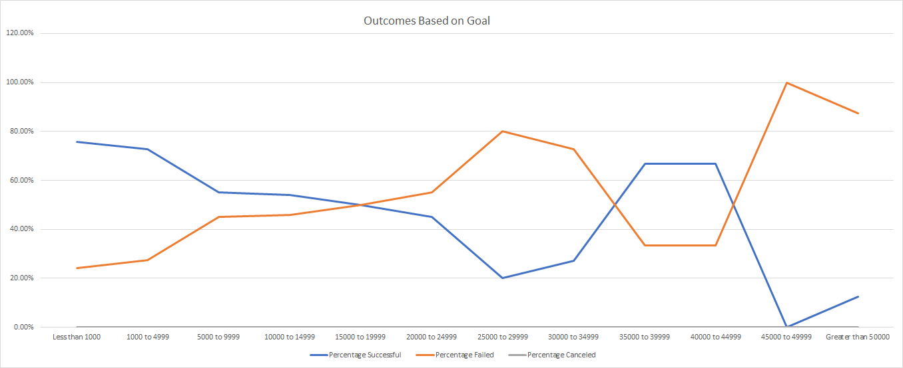

# Kickstarting with Excel

## Overview of Project

### Purpose
The purpose of this project is to analyze trends in Kickstarter theater campaigns based on their launch date and play campaigns based on goal to try and determine the most effective launch date for theater and goal for plays.
## Analysis and Challenges
### Analysis of Outcomes Based on Launch Date
We can see in the chart below that there were more successful campaigns that launched in May than any other month, and it slowly declines until September. This would indicate that May would be the month to launch a kickstarter campaign with the highest probability of success.

### Analysis of Outcomes Based on Goals
We can see in the chart below that success rates for play kickstarter campaigns decreases as the goal increases up to $30,000, and then peaks again around $35,000-$45,000. This would indicate that there is success in kickstarter campaigns for low-production plays and also for more expensive productions; with a lull in between.

### Challenges and Difficulties Encountered

## Results

- Based on outcomes by launch date, I conclude that May would be the best month to start a theater kickstarter campaign. Furthermore, December would be the worst month to start a theater kickstarter campaign.

- Based on the outcomes by goal, I conclude that the ideal goal for a play kickstarter would be under $5000 or between $35,000 and $45,000; depending on the size of the production.

- These analyses do not include live campaigns, and is limited to 4114 entries. With more data and including *all* of the data, we could achieve more accurate results.

- We could also create a table and/or graph to indicate the average duration of successful and failed campaigns and then weigh that against the analysis of outcomes based on launch date to anticipate a successful campaign's duration.
